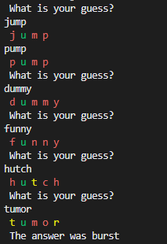

# Wordle
This is my reacreateion of Wordle in python.

## Instructions
You are given six chance to guess a five letter word. Each time you guess it will show you how close you  were
to guessing the random word based off color:
* Red: This letter is not in the word
* Yellow: This letter is in the word but not in the correct location
* Green: This letter is in the word and in the correct location

If you cannot guess the word within six tries you loose the game and the correct word will be displayed.

## Examples

